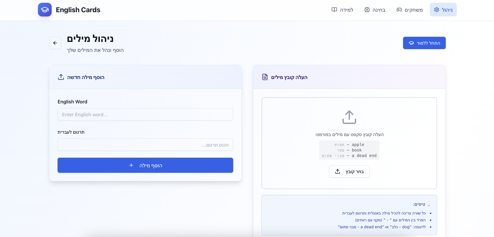
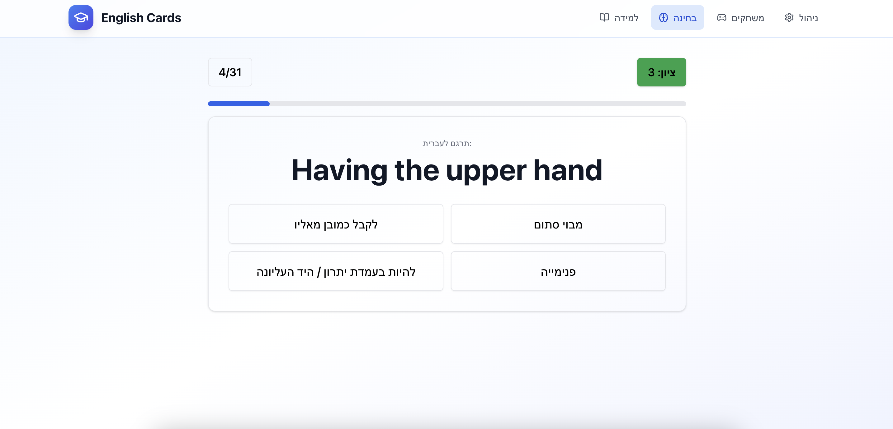
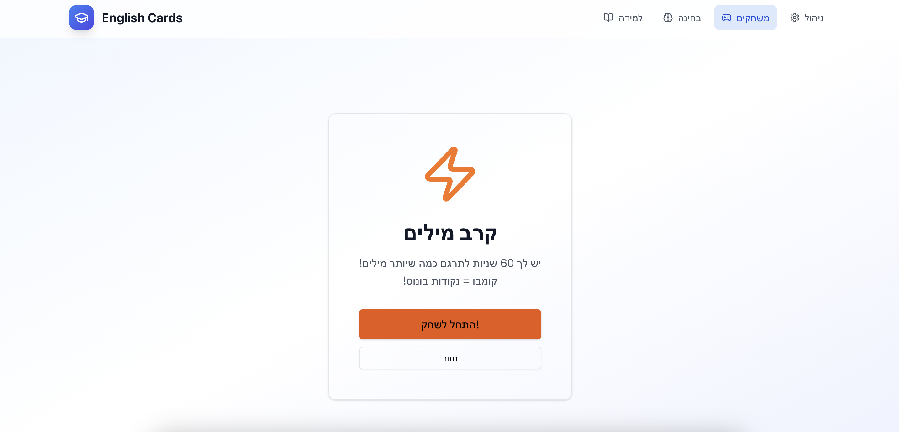
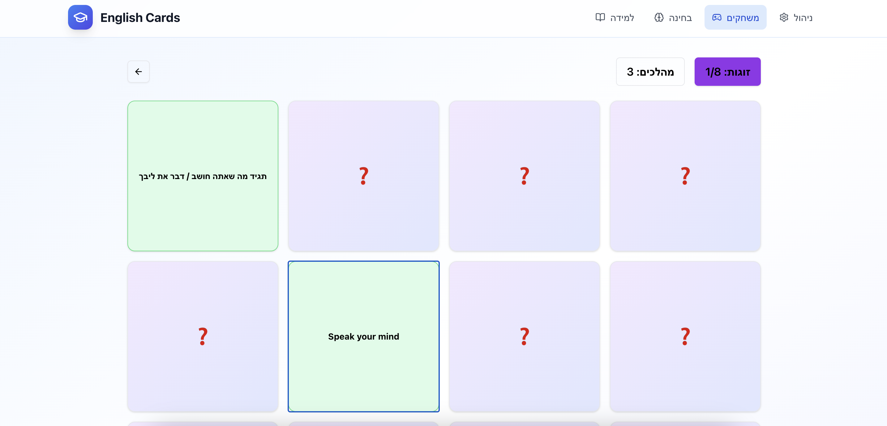

# 📚 English Learning

A web application built with Base44 to help you memorize and learn English words through interactive cards, quizzes, and a memory game.
  

## ✨ Features

* Word Cards: Browse cards with English words and their translations to improve vocabulary.
* Multiple Choice Quizzes: Test your knowledge by choosing the correct translation from multiple options. 
* Writing Quizzes: Practice spelling and recall by typing the correct translation. 
* Memory Card Game: Improve memory and language retention with a fun card-matching game.
* Interactive & User-Friendly: Engaging interface designed to make learning enjoyable.
  

## 🛠️ Tech Stack

* React 
* Local storage
* TailwindCSS
  

## 🚀 Future Plans

* Add progress tracking to see improvement over time.
* Implement user accounts for personalized learning.
  

## Screenshots

#### Manage Words

#### Cards

#### Quiz

#### Time Challenge

#### Memory Game

  

## 💻 Installation

    git clone https://github.com/alfinaim/English-Cards.git
    cd English-Cards
    npm install
    npm start
